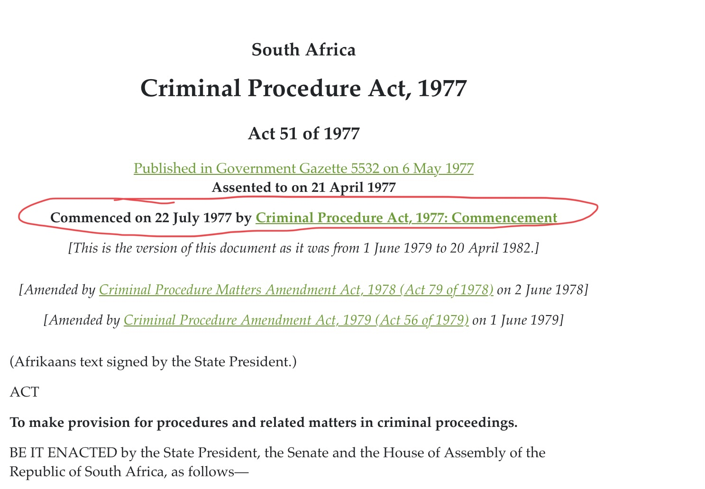
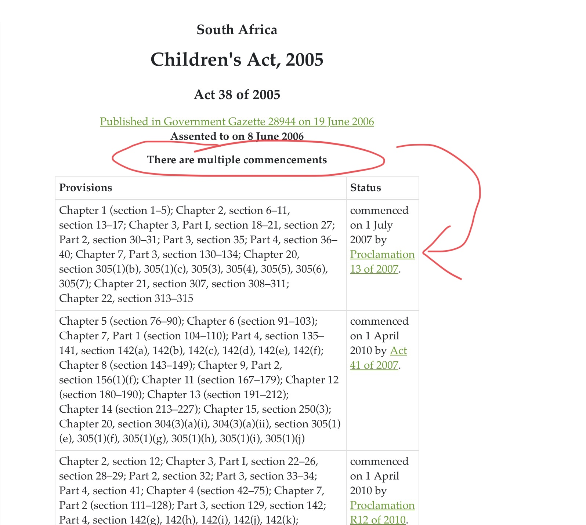
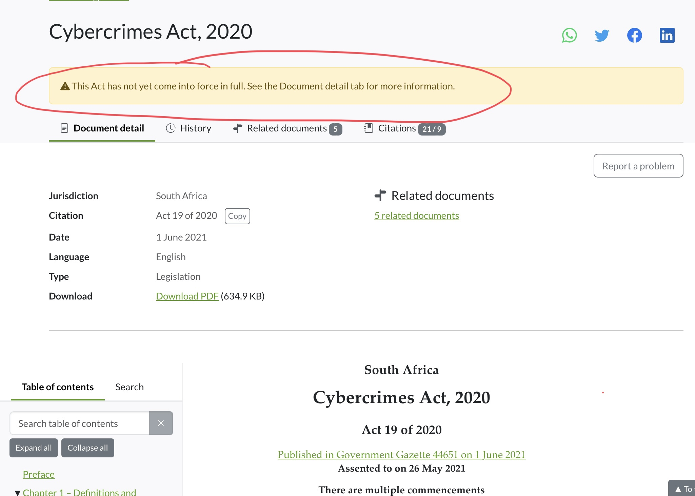

# Commencements

(% if APPNAME == "LawLibrary" %)

(% elif APPNAME == "TanzLII" %)

(% elif APPNAME == "ULII" %)

(% endif %)

Conduct your research with peace of mind as we have included the commencement dates of legislation, as part of the meta data provided.&#x20;

## How to spot a commencement date&#x20;

<figure><figcaption></figcaption></figure>

As seen in the image above, the commencement date is located under the title of the act, for your convenience. In addition the statutory instrument that commences the act is provided and linked for your perusal.&#x20;

## Multiple commencement dates&#x20;

Some pieces of legislation contain multiple commencement dates. This means that various sections come into force at different dates. Once again, for your convenience, this is displayed in a table below the title of an act/statue; as shown below.&#x20;

In addition, the commencing instrument is provided and linked for your perusal.&#x20;

<figure><figcaption></figcaption></figure>

## Not yet in force

<figure><figcaption></figcaption></figure>

Please watch out for the banner displayed above. This banner alerts a user when an act has come into force in part and not in full. This eliminates the risk of applying and using an act or section of such act, that has not come into force yet.&#x20;

