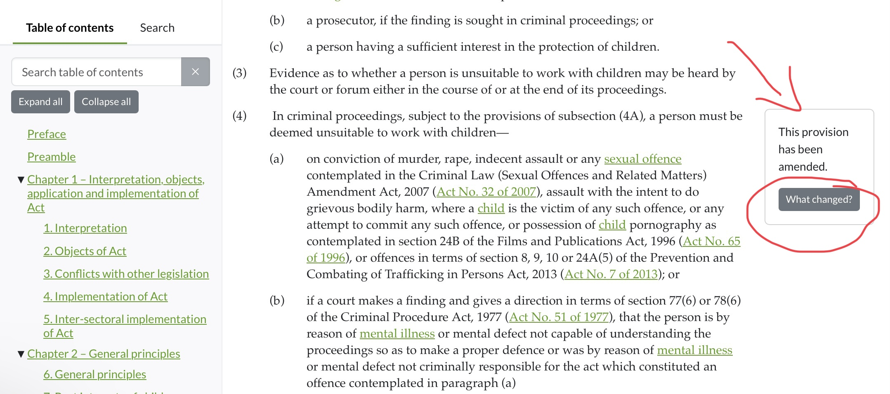
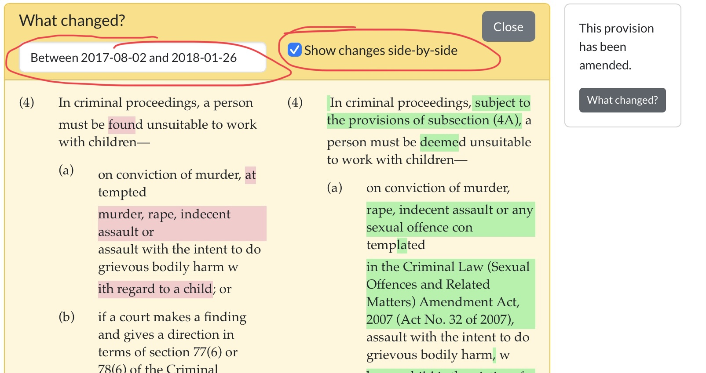
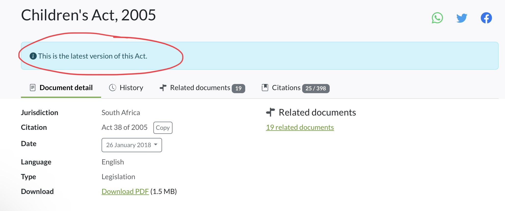

# Comment comparer les versions

Saviez-vous que vous pouvez comparer les versions antérieures d'un texte législatif, ce qui facilite la recherche juridique comparative ?

## C'est parti!

Lorsque vous explorez un texte législatif sur la plateforme, il se peut que vous tombiez sur une annotation "ce qui a changé" dans la marge latérale droite de la page.

<figure><figcaption></figcaption></figure>

## Comparer les versions

Comparer la version modifiée d'une disposition avec sa version précédente :

1. Il suffit de cliquer sur la fonction **"ce qui a changé"**.
2. Une fenêtre contextuelle apparaît, vous permettant de choisir les versions que vous souhaitez comparer et de visualiser les modifications **côte à côte**.

<figure><figcaption></figcaption></figure>

## Astuces!

* Veuillez noter que lorsque vous regardez les dispositions côte à côte, la partie gauche est la version précédente et la version modifiée est affichée sur la partie droite.
* Les mots surlignés en rouge sur le côté droit correspondent à ce qui a été supprimé dans la version précédente. Les mots surlignés en vert sur le côté gauche sont ceux qui ont été ajoutés ou insérés dans la version modifiée.
* Surveillez la mention **"Ceci est la dernière version de cette loi"** qui figure en haut du document. Cette mention signifie que toutes les modifications ont été appliquées au document et que vous consultez la dernière version de la législation.

<figure><figcaption></figcaption></figure>

##

##
