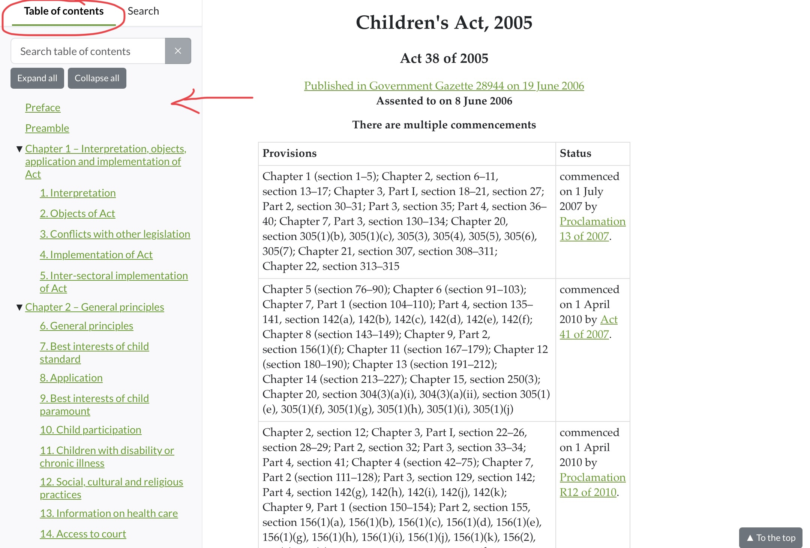
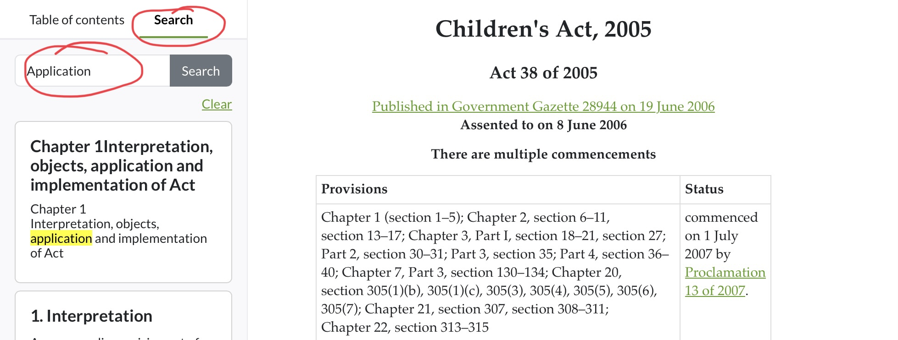

# Table des matières du document (TOC)

Vous pouvez explorer efficacement le contenu de la législation en utilisant la table des matières du document pour passer d'une section à l'autre.

Cette fonction est particulièrement utile pour les documents longs.

## Vous pouvez accéder à la table des matières en suivant 3 étapes simples !

1. Faites une recherche et [trouvez](legislation/recherche-de-legislation.md) la législation particulière que vous souhaitez explorer. &#x20;
2. Une fois le document ouvert, vous trouverez **une table des matières** complète sur le côté gauche de la page.

<figure><figcaption></figcaption></figure>

3. Il suffit de cliquer sur la section, le chapitre, l'horaire, etc. que vous souhaitez consulter pour y accéder sans avoir à faire défiler l'ensemble du document !

**Astuces!**

Vous pouvez utiliser **la fonction de recherche** dans la table des matières pour effectuer une recherche dans l'ensemble du document.

<figure><figcaption></figcaption></figure>

