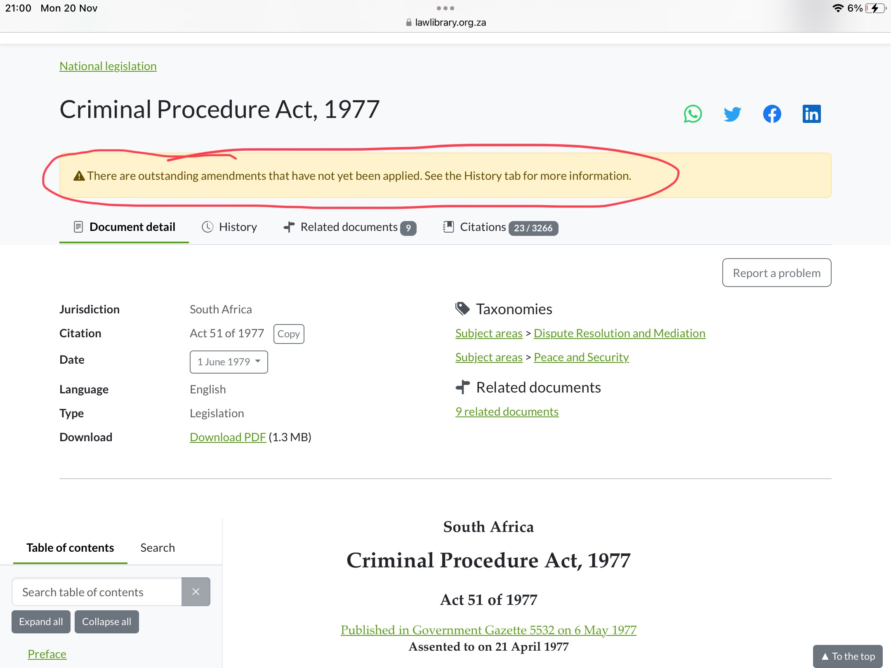

# Versions historiques : Amendements, Onglet historique

Effectuez vos recherches facilement, car nous avons inclus les amendements à la législation dans les métadonnées fournies.&#x20;

## Comment suivre les modifications apportées à la législation ?

Il existe plusieurs façons de suivre les modifications. Si vous suivez l'une des étapes suivantes, vous devriez être en mesure de naviguer à travers les modifications de la législation

## Commençons

**Option 1: Trouver la liste des amendements sur le document**

Une liste des textes législatifs modificatifs se trouve au début du document, sous le titre et d'autres métadonnées.

<figure><figcaption></figcaption></figure>

Veuillez noter que les documents de modification sont liés et que vous pouvez accéder au document original d'un simple clic.

**Option 2: Onglet Historique**

Vous pouvez également suivre les modifications et trouver des informations supplémentaires sur le cycle de vie d'un texte législatif en utilisant **l'onglet Historique**. Une fois de plus, les textes législatifs ou réglementaires affichés ici sont également liés pour plus de commodité.

<figure><figcaption></figcaption></figure>

**Option 3: Onglet Documents connexes**

**L'onglet Documents connexes** fournit une liste des textes législatifs ou réglementaires modificatifs. Il fournit également une liste des lois modifiées par le document que vous consultez. Les textes législatifs ou réglementaires affichés ici sont également liés pour votre commodité.

<figure><figcaption></figcaption></figure>

## Conseils!

Surveillez la bannière qui vous indique si les modifications apportées au document que vous consultez ont été appliquées ou non.

<figure><figcaption></figcaption></figure>

Si les modifications n'ont pas été appliquées, vous pouvez accéder au document modificatif dans **l'onglet Historique** ou **Document connexe**, comme indiqué ci-dessus.
