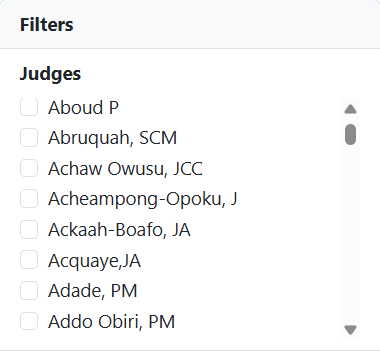

# Courts

## Introduction

Courts deliver judgments, which are the main way that judgments are grouped on the platform. Exploring the courts is a good way to find a judgment issued by a particular court.

## Finding judgments by exploring courts

1. Click on **Judgments** in the top navigation bar or on the homepage.
2. Click on a **court's name** to explore judgments from that court.
3.  Click on a **year** to limit judgments to a particular year.

    <figure><figcaption></figcaption></figure>
4.  Click on **Judges** in the Filters box on the left to refine the results further to a particular judge.\

    
<figure><figcaption></figcaption></figure>
