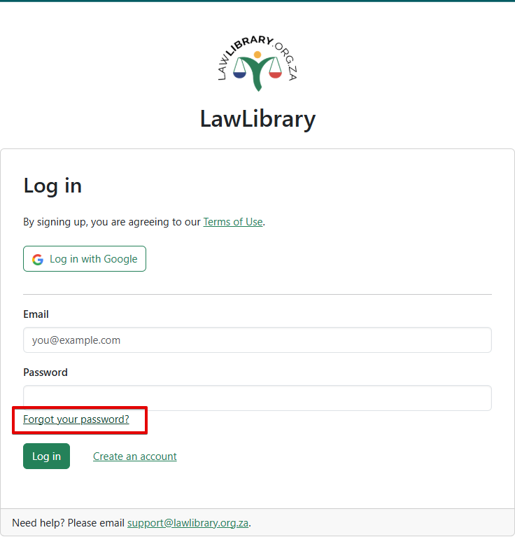
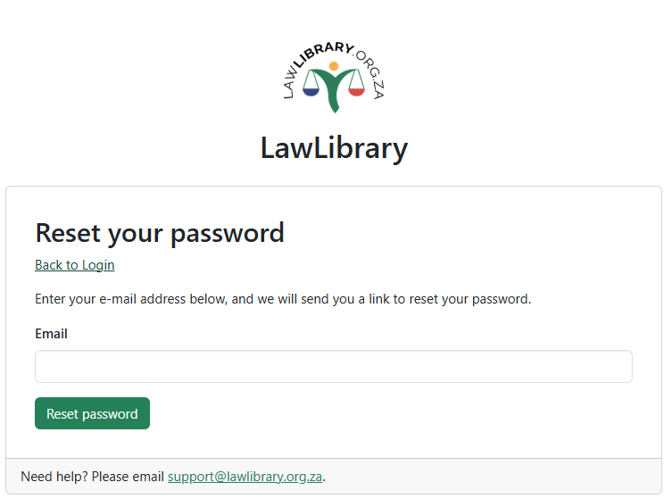
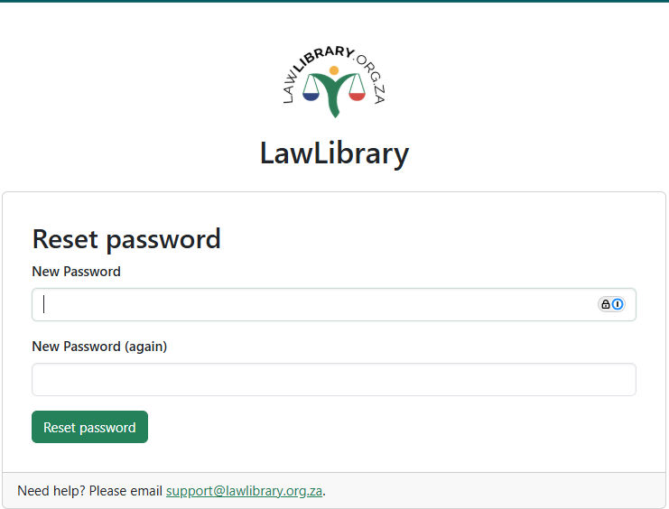
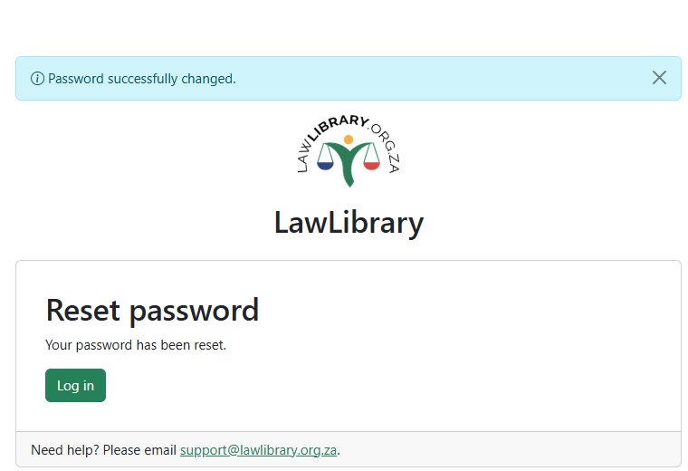

# How to reset your password

1. Click **Forgot your password?** below the password field on the login page

<figure><figcaption></figcaption></figure>

2. Go to the **Reset your password** page, enter the email address linked to your LawLibrary account&#x20;
3. Click **Reset password**

<figure><figcaption></figcaption></figure>

4. Check your email for a Reset your password message.

<figure><figcaption></figcaption></figure>

5. Click the **Reset your password** button in the email to set a new password.
6. Enter your **new password**, confirm it, and click **Reset password**.

<figure><figcaption></figcaption></figure>

7. Click **Log in** using your new password to sign in once your password has been successfully changed.

<figure><figcaption></figcaption></figure>