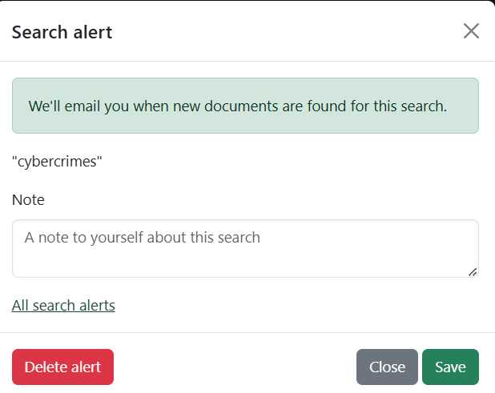

# Glossary of defined terms

The legislation glossary is an index of all the terms that are defined in legislation. The glossary makes it easy to see how the same term is defined across legislation.

## How to find the Glossary

1. Click **Legislation**
2. Under **More resources**, click **Glossary of defined terms**.

## How to use the Glossary

Use the glossary to find a specific term you are looking for, such as "youth".

1. Click the entry for the first letter of the term, such as **Y** for "youth".
2. The glossary will load.
3. Scroll down through the list of terms to find the one you are looking for.
4. Filter the terms to quickly find the one you need by typing the first few letters into the **Find a term...** box.
5. The glossary will update to show matching terms.

## Understanding an entry in the Glossary

<figure><figcaption></figcaption></figure>

An entry in the glossary includes:

* a definition of the term (taken from one of the pieces of legislation that defines the term); and
* a list of legislation that defines the term.

Similar definitions are grouped together.

Click **X groups of similar definitions...** to expand it and see all legislation that defines the term, and all the different definitions.
