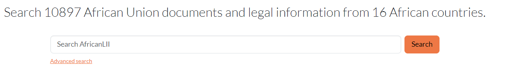

# Federated Search on AfricanLII

## How to conduct Federated Search

1. Go to [https://africanlii.org/](https://africanlii.org/)

<figure><figcaption></figcaption></figure>

2. Enter search terms or a document name in the search bar, and click **Search**
3. The documents that match your search are shown including the respective **jurisdiction** the documents belong in.
4. Narrow the results by using the **filters** on the left to pinpoint what you’re looking for.
5. Use the Sort by option to sort results by relevance or date.

## Focus results with filters

Here’s an example. A search for "[refugees ](https://africanlii.org/search/?q=refugees)"returns over 1840 documents.

<figure><figcaption></figcaption></figure>

Apply multiple filters to refine your search. Let’s look for Gazettes with the term refugees from 2023 in South Africa.

<figure><figcaption></figcaption></figure>

Federated search makes it easy to find related information from various jurisdictions and regional bodies.