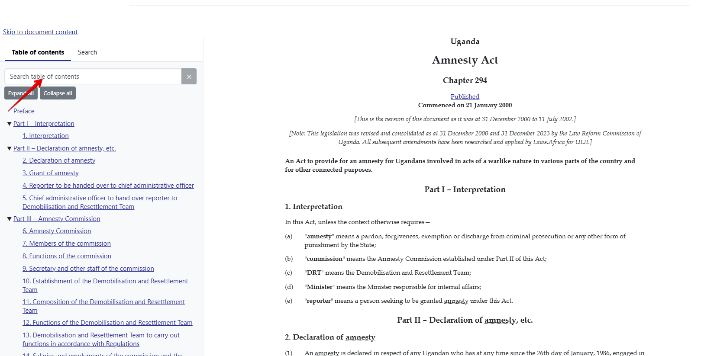

# Document table of contents

You can efficiently explore a large document, by using the table of contents to navigate sections.

## To access the Table of Contents

1. Locate the legislation
2. Open the document to view the **Table of contents** on the left-hand side of the page.

<figure><figcaption></figcaption></figure>

3. Scroll through the **Table of Contents** using the scroll bar on the right to view the various sections.
4. Alternatively, you can use the **Search table of contents** to perform a search in the table of contents.
5. Use the "**Expand All**" and "**Collapse All**" buttons to expand or collapse all headings in your document.
6. Click on the **Chapter, Section, Part,** or **Paragraph** that contains the content you want.
7. The page will automatically jump to that part of the document.
