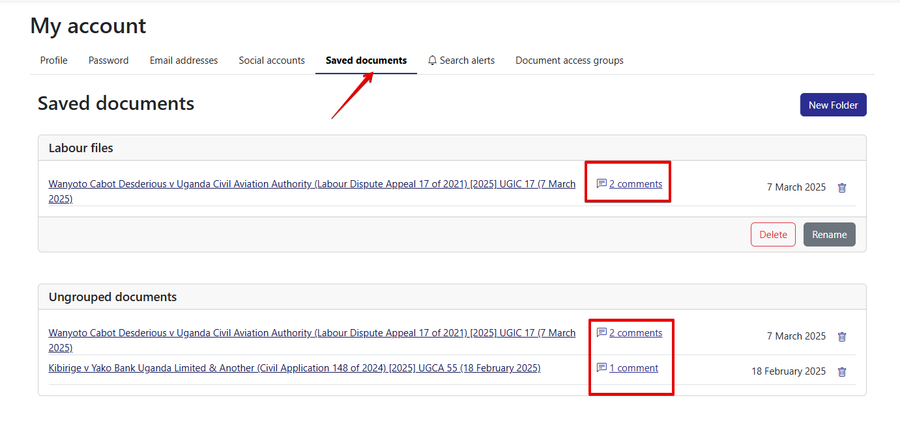

# Commenting in a document

1. Open the document you want to work on.
2. Ensure you are logged into your account to enable the commenting feature.
3. Navigate through the document and locate the section you want to comment on.
4. Click and drag your cursor over the specific text to highlight it, a pop-up menu appears next to the highlighted text.

<figure><figcaption></figcaption></figure>

5. Click the"**Add comment**" option in the pop-up.
6. Type your comment in the text box.
7. Click "Save" to confirm your comment and ensure the document is saved if it has not already been saved.

<figure><figcaption></figcaption></figure>

8. Click the dropdown menu to access the "**Edit**" or "**Delete**" options, allowing you to modify or remove your comment as needed.

<figure><figcaption></figcaption></figure>

9. To view all your annotated documents, navigate to your profile's "Saved Documents" section. Look for documents with the **comment icon**, which indicates annotations.

<figure><figcaption></figcaption></figure>

10. Click the comment icons to view, edit, or delete annotations on your saved documents.

### Tip:

Deleting all comments from a saved document does not remove the document from your saved list. If you want to see the number of comments on a document, check the comment icons—they display the count.